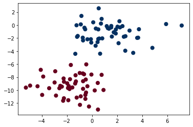

```python
import pandas as pd
```


```python
from sklearn import preprocessing
```


```python
from sklearn.model_selection import train_test_split
```


```python
from sklearn.naive_bayes import GaussianNB
```


```python
from sklearn.metrics import accuracy_score
```


```python
from sklearn.metrics import confusion_matrix
```


```python
data=pd.read_csv("diabetes.csv")
```


```python
data.columns
```


    Index(['Glucose', 'BloodPressure', 'SkinThickness', 'Insulin', 'BMI',
           'DiabetesPedigreeFunction', 'Age', 'Outcome'],
          dtype='object')


```python
y=data["Outcome"]
```


```python
X=data.drop(["Outcome"],axis=1)
```


```python
X.head()
```


<div>
<style scoped>
    .dataframe tbody tr th:only-of-type {
        vertical-align: middle;
    }

    .dataframe tbody tr th {
        vertical-align: top;
    }

    .dataframe thead th {
        text-align: right;
    }
</style>
<table border="1" class="dataframe">
  <thead>
    <tr style="text-align: right;">
      <th></th>
      <th>Glucose</th>
      <th>BloodPressure</th>
      <th>SkinThickness</th>
      <th>Insulin</th>
      <th>BMI</th>
      <th>DiabetesPedigreeFunction</th>
      <th>Age</th>
    </tr>
  </thead>
  <tbody>
    <tr>
      <th>0</th>
      <td>148</td>
      <td>72</td>
      <td>35</td>
      <td>0</td>
      <td>33.6</td>
      <td>0.627</td>
      <td>50</td>
    </tr>
    <tr>
      <th>1</th>
      <td>85</td>
      <td>66</td>
      <td>29</td>
      <td>0</td>
      <td>26.6</td>
      <td>0.351</td>
      <td>31</td>
    </tr>
    <tr>
      <th>2</th>
      <td>183</td>
      <td>64</td>
      <td>0</td>
      <td>0</td>
      <td>23.3</td>
      <td>0.672</td>
      <td>32</td>
    </tr>
    <tr>
      <th>3</th>
      <td>89</td>
      <td>66</td>
      <td>23</td>
      <td>94</td>
      <td>28.1</td>
      <td>0.167</td>
      <td>21</td>
    </tr>
    <tr>
      <th>4</th>
      <td>137</td>
      <td>40</td>
      <td>35</td>
      <td>168</td>
      <td>43.1</td>
      <td>2.288</td>
      <td>33</td>
    </tr>
  </tbody>
</table>
</div>


```python
X_train,X_test,y_train,y_test=train_test_split(X,y,test_size=0.3,random_state=True)
```


```python
X_train.head()
```


<div>
<style scoped>
    .dataframe tbody tr th:only-of-type {
        vertical-align: middle;
    }

    .dataframe tbody tr th {
        vertical-align: top;
    }

    .dataframe thead th {
        text-align: right;
    }
</style>
<table border="1" class="dataframe">
  <thead>
    <tr style="text-align: right;">
      <th></th>
      <th>Glucose</th>
      <th>BloodPressure</th>
      <th>SkinThickness</th>
      <th>Insulin</th>
      <th>BMI</th>
      <th>DiabetesPedigreeFunction</th>
      <th>Age</th>
    </tr>
  </thead>
  <tbody>
    <tr>
      <th>88</th>
      <td>136</td>
      <td>70</td>
      <td>32</td>
      <td>110</td>
      <td>37.1</td>
      <td>0.153</td>
      <td>43</td>
    </tr>
    <tr>
      <th>467</th>
      <td>97</td>
      <td>64</td>
      <td>36</td>
      <td>100</td>
      <td>36.8</td>
      <td>0.600</td>
      <td>25</td>
    </tr>
    <tr>
      <th>550</th>
      <td>116</td>
      <td>70</td>
      <td>28</td>
      <td>0</td>
      <td>27.4</td>
      <td>0.204</td>
      <td>21</td>
    </tr>
    <tr>
      <th>147</th>
      <td>106</td>
      <td>64</td>
      <td>35</td>
      <td>119</td>
      <td>30.5</td>
      <td>1.400</td>
      <td>34</td>
    </tr>
    <tr>
      <th>481</th>
      <td>123</td>
      <td>88</td>
      <td>37</td>
      <td>0</td>
      <td>35.2</td>
      <td>0.197</td>
      <td>29</td>
    </tr>
  </tbody>
</table>
</div>


```python
y_train.head()
```


    88     1
    467    0
    550    0
    147    0
    481    0
    Name: Outcome, dtype: int64


```python
X_test.head()
```


<div>
<style scoped>
    .dataframe tbody tr th:only-of-type {
        vertical-align: middle;
    }

    .dataframe tbody tr th {
        vertical-align: top;
    }

    .dataframe thead th {
        text-align: right;
    }
</style>
<table border="1" class="dataframe">
  <thead>
    <tr style="text-align: right;">
      <th></th>
      <th>Glucose</th>
      <th>BloodPressure</th>
      <th>SkinThickness</th>
      <th>Insulin</th>
      <th>BMI</th>
      <th>DiabetesPedigreeFunction</th>
      <th>Age</th>
    </tr>
  </thead>
  <tbody>
    <tr>
      <th>285</th>
      <td>136</td>
      <td>74</td>
      <td>26</td>
      <td>135</td>
      <td>26.0</td>
      <td>0.647</td>
      <td>51</td>
    </tr>
    <tr>
      <th>101</th>
      <td>151</td>
      <td>60</td>
      <td>0</td>
      <td>0</td>
      <td>26.1</td>
      <td>0.179</td>
      <td>22</td>
    </tr>
    <tr>
      <th>581</th>
      <td>109</td>
      <td>60</td>
      <td>27</td>
      <td>0</td>
      <td>25.0</td>
      <td>0.206</td>
      <td>27</td>
    </tr>
    <tr>
      <th>352</th>
      <td>61</td>
      <td>82</td>
      <td>28</td>
      <td>0</td>
      <td>34.4</td>
      <td>0.243</td>
      <td>46</td>
    </tr>
    <tr>
      <th>726</th>
      <td>116</td>
      <td>78</td>
      <td>29</td>
      <td>180</td>
      <td>36.1</td>
      <td>0.496</td>
      <td>25</td>
    </tr>
  </tbody>
</table>
</div>


```python
y_test.head()
```


    285    0
    101    0
    581    0
    352    0
    726    0
    Name: Outcome, dtype: int64


```python
from sklearn.naive_bayes import *
```


```python
clf=BernoulliNB()
```


```python
clf.fit(X_train,y_train)
```


    BernoulliNB()


```python
y_pred=clf.predict(X_test)
```


```python
accuracy_score(y_test,y_pred,normalize=True)
```


    0.6017316017316018


```python
confusion_matrix(y_test,y_pred)
```


    array([[138,   8],
           [ 84,   1]], dtype=int64)


```python
clf1=GaussianNB()
```


```python
clf1.fit(X_train,y_train)
```


    GaussianNB()


```python
y_pred1=clf1.predict(X_test)
```


```python
accuracy_score(y_test,y_pred,normalize=True)
```


    0.6017316017316018


```python
confusion_matrix(y_test,y_pred)

```


    array([[138,   8],
           [ 84,   1]], dtype=int64)


```python
print("Outcome")
print("accuracy on training set :{:.2f}".format(clf1.score(X_train,y_train)))
print("accuracy on test set :{:.2f}".format(clf1.score(X_test,y_test)))
```

    Outcome
    accuracy on training set :0.75
    accuracy on test set :0.79
    


```python
%matplotlib inline
import numpy as np
import matplotlib.pyplot as plt
import seaborn as sns
```


```python
from sklearn.datasets import make_blobs
```


```python
train_X,train_y=make_blobs(100,2,centers=2,random_state=2,cluster_std=1.5)
plt.scatter(X[:,0],X[:,1],c=y,s=50,cmap="RdBu")
```


    <matplotlib.collections.PathCollection at 0x1ac43e724c0>





```python

```
